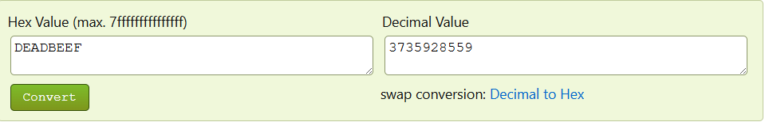

## Challenge Overview
We are given a binary called `vuln` that asks for a name and a secret code. If the correct code is entered, the program prints the flag.

## Initial Analysis
First I loaded the binary into [Dogbolt](https://dogbolt.org/) to quickly view the decompiled source.

```
int32_t main(int32_t argc, char** argv, char** envp)
{
    setup();
    int32_t var_c = 0xdeadbeef;
    printf("What is your name? ");
    char var_58[0x4c];
    fgets(&var_58, 0x40, stdin);
    var_58[strcspn(&var_58, "\n")] = 0;
    printf("Hello, ");
    printf(&var_58);
    puts("!");
    printf("Enter the secret code: ");
    int32_t var_5c;
    __isoc99_scanf("%u", &var_5c);
    
    if (var_5c != var_c)
        puts("Wrong! Nice try.");
    else
        print_flag();
    
    return 0;
}

int64_t _fini() __pure
{
    return;
}
```

The `main` function revealed a variable initialized to a suspicious value:

int32_t var_c = 0xdeadbeef;

Later in the program the user is asked to input a secret code, which is compared directly against this value.

## Vulnerability Discovery
Looking further into the code revealed two notable issues:

1. A **hardcoded secret value** used to validate the input.
2. A **format string vulnerability** where user input is passed directly into `printf`.

printf(&var_58);

The format string bug could allow memory leaks or writes, but it is not required to solve the challenge. For the sake of time, I did the quicker way. Think smarter not harder I say.

## Solution
Since the program simply compares the input against the value `0xdeadbeef`, we can convert it to its decimal representation in something an online [converter](https://www.binaryhexconverter.com/hex-to-decimal-converter):



The program reads the value using `%u`, meaning it expects an unsigned decimal integer.

## Exploitation
Running the binary locally and entering the decimal value prints the flag:

```
$ ./vuln
What is your name? test
Hello, test!
Enter the secret code: 3735928559
utflag{f0rm4t_str1ng_l34k3d}
```

## Flag
utflag{f0rm4t_str1ng_l34k3d}
